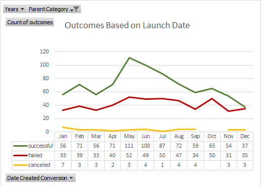
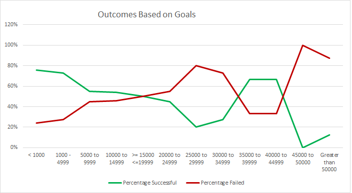

# Columbia Engineering Data Analytics : Module 1 Challenge

# An Analysis of Kickstarter Campaigns
An analysis of historical Kickstarter campaigns, focused on theater projects, to better understand how our client Louise's recent campaign compares to other similar campaigns.

## Overview of Project
The objective of this analysis is to provide our client, Louise, with historical information on Kickstarter campaigns similar to her campaign. With this analysis, our client will have a better comprehension of how different campaigns fared about their launch dates and how this information could be used to help make a campaign successful.

### Purpose

## Analysis and Challenges
Our analysis focused primarily on the launch date and campaign goals, as these are variables that we can control, and affect the success of a campaign. 

Some extreme outliers on goals and funding provided a challenge, but we were able to work around this by dropping campaigns into goal dollar value categories. The data also includes campaigns that are currently live, and thus should not be compared. We filtered these out of the data, so we were only looking at completed Kickstarter campaigns.

### Analysis of Outcomes Based on Launch Date
Launch date appears to have an effect on the success of past Kickstarter campaigns.

### Analysis of Outcomes Based on Goals
Lower dollar value campaigns have succeeded at a higher rate, gradually declining as the campaigns' expectations get higher. Assertive conclusions should not be drawn from a sample of 8 campaigns. 

### Challenges and Difficulties Encountered

## Results

### What are two conclusions you can draw about the Outcomes based on Launch Date?
- Theater Kickstarter campaigns are more likely to succeed when launched in May (67%), with similar but less strong effects in April, June, and July. 
- We can also conclude that 51% of campaigns of this were launched between April and August. 

### What can you conclude about the Outcomes based on Goals?
There is approximately a 62% chance for theatre plays to be successful if the Campaign goal is less than $20,000. However, the success percentage increases to 76% for pays where their campaign goal is less < 1,000. 

### What are some limitations of this dataset?
- We don’t know how representative this data is of the Kickstarter population, and the little data on high dollar value target campaigns(2%), which can lead us to erroneous outliers identification.
- A specific dataset ascertaining the amount of social outreach a campaign does, such as the number of ads, tweets, might imply higher success rates for those campaigns that reached out more.

### What are some other possible tables and/or graphs that we could create?
- A Regression analysis could be made to estimate the relationships between **staff picks** and/or **spotlight** to successful outcomes.

Difference between Regression and Correlation
> Correlation shows the relationship between the two variables, while regression allows us to see how one affects the other.
